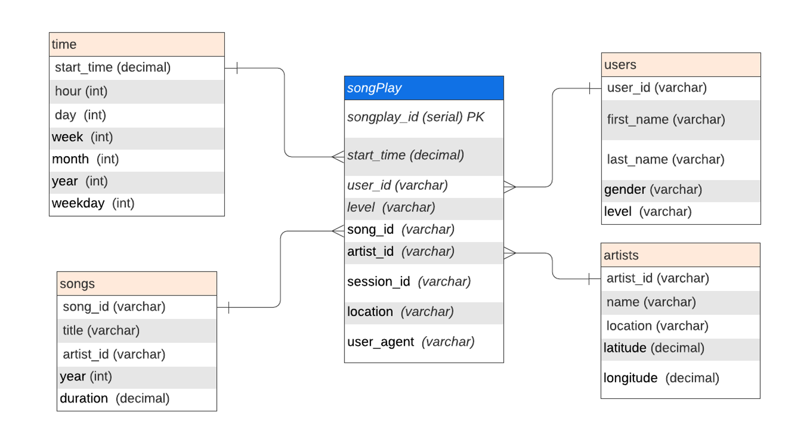

# Sparkify Data Lake

## Purpose
The purpose of this database is to move Sparkify's analytics processes and data into a data lake, in order to enable faster, more flexible, ad-hoc analysis. Currently, the data resides in S3, in a directory of JSON logs on user activity on the app, as well as a directory with JSON metadata on the songs in their app. This database, developed using Spark, reads the s3 data into a staging tables, before writing the data into series of fact and dimension tables in parquet format, as defined below. The parquet files are also stored in S3:

## Schema and ETL Pipeline
Schema for the database is depicted below:

This design allows for faster reads on user session data, while also attempting to minimize data redundancy within the datawarehouse. To create and populate the tables, the following python scripts were used:

- **sql_queries.py**: Defines queries to extract necessary columns from the log and song files for each parquet
- **etl.py**: Copies log and song files to staging, by invoking sql_queries, and then writes parsed data to parquet files in s3
- **dwh.cfg**: Config file that contains connection parameters to the sparkify data lake, as well as paths to the s3 log and json files 

To create the and populate the databases, follow the following steps:
1. Create AWS EMR cluster and IAM role
2. Populate the dwh.cfg file with the correct database credentials and IAM ARN
3. Execute the etl.py file.